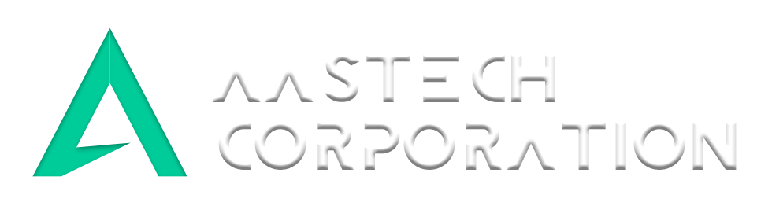
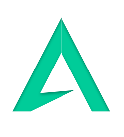

<br />
<p align="center">
  <a href="https://github.combrn-borges/aatstech-corporation">
    
  </a>

  <h3 align="center">Aatstech Corporation</h3>

  <p align="center">
    A Aatstech é uma empresa especializada em vazamentos. <br>
    Nosso maior obejetivo é disponibilizar um produto a preços acessivel a toda a população!
    <br />
    <a href="https://github.com/brn-borges/aatstech-corporation"><strong>Explore os documentos»</strong></a>
    <br />
    <br />
    <a href="https://brn-borges.github.io/aatstech-corporation/">Veja demonstração</a>
    ·
    <a href="https://github.com/brn-borges/aatstech-corporatio/issues">Reportar Bug</a>
    ·
    <a href="https://github.com/brn-borges/aatstech-corporatio/issues">Solicitar Request </a>
  </p>
</p>


<!-- TABLE OF CONTENTS -->
<details open="open">
  <summary>Índice</summary>
  <ol>
    <li>
      <a href="#sobre-o-projeto">Sobre o projeto</a>
      <ul>
        <li><a href="#construção">Construção</a></li>
      </ul>
    </li>
    <li>
      <a href="#começando">Começando</a>
      <ul>
        <li><a href="#pre-requisitos">Pré-requisitos</a></li>
        <li><a href="#instalação">Instalação</a></li>
      </ul>
    </li>
    <li><a href="#roteiro">Roteiro</a></li>
    <li><a href="#contribuições">Contribuições</a></li>
    <li><a href="#contato">Contato</a></li>
  </ol>
</details>

## Sobre o projeto

<p align="center">
  <a href="https://github.combrn-borges/aatstech-corporation">
    
  </a>

A ideia do projeto se deve ao problema encontrado no dia-a-dia, onde no local da instituição SENAC (Franca/SP), onde tivemos complicações sobre vazamento de água, portanto foi obrigado a cancelar as aulas do período da noite e convocar uma empresa terceirizada da área para resolver tal transtorno citado.
Projeto tem o intuito de desenvolver melhorias para identificar vazamentos internos com equipamentos de baixo custo. Em primeira mão o protótipo tem objetivo de detectar umidade e sua intensidade de forma precisa em uma escala pré-determinada.

Porque:
  
* O presente projeto justifica pela relevância agregado a empresa, onde se observando o problema gerado pela degradação da estrutura de uso constante, foi proposto pelos estudantes de técnico de informática da turma N°39, uma possível solução para o obstáculo, assim economizando tempo na localização do contratempo e facilitando o trabalho da empresa terceirizada.

* Pensando nisso, os alunos do curso técnico de informática N°39 debateram, chegando a uma conclusão de que havia necessidade de um equipamento para auxiliar casos como esse que não fosse um problema tão grave, assim auxiliando na solução da complicação. :smile:

### Construção

As principais estruturas que usamos para construir o projeto. 

* [Bootstrap](https://getbootstrap.com)
* [PHP](https://www.php.net/)
* [JavaScript](https://www.javascript.com/)


<!-- GETTING STARTED -->
## Começando

Para obter uma cópia local instalada e funcionando, siga estas etapas simples de exemplo.

## Pré-requisitos

Listar das coisas de que você precisa para usar a pagina e como instalá-las.

* git 
  ```sh
  sudo dnf install git-all
  ```

### Instalação

1. Obtenha uma chave de API gratuita em [https://github.com/brn-borges/aatstech-corporation.git](https://github.com/brn-borges/aatstech-corporation.git)
2. Clone o repositório
   ```sh
   git clone https://github.com/brn-borges/aatstech-corporation.git
   ```

## Roteiro

Veja os [problemas abertos](https://github.com/brn-borges/aatstech-corporation/issues) para uma lista de recursos propostos (e problemas conhecidos).

## Contribuições

As contribuições são o que tornam a comunidade de código aberto um lugar incrível para aprender, inspirar e criar. Quaisquer contribuições que você fizer são ** muito apreciadas **.

1. Faça um fork do projeto
2. Crie seu Feature Branch (`git checkout -b feature / AmazingFeature`)
3. Faça commit de suas alterações (`git commit -m 'Add some AmazingFeature'`)
4. Envie para o Branch (`git push origin feature / AmazingFeature`)
5. Abra uma solicitação Pull Request


## Contato

Bruno Borges - [@BRN-BORGES](https://linkedin.com/in/brn-borges) - bruno.bferreira3@gmail.com

Project Link: [https://github.com/brn-borges/aatstech-corporation](https://github.com/brn-borges/aatstech-corporation)

[![Contributors][contributors-shield]][contributors-url]
[![Forks][forks-shield]][forks-url]
[![Stargazers][stars-shield]][stars-url]
[![LinkedIn][linkedin-shield]][linkedin-url]

[contributors-shield]: https://img.shields.io/github/contributors/brn-borges/aatstech-corporation?style=for-the-badge
[contributors-url]: https://github.com/brn-borges/aatstech-corporation/graphs/contributors
[forks-shield]: https://img.shields.io/github/forks/brn-borges/aatstech-corporation?style=for-the-badge
[forks-url]: https://github.com/brn-borges/aatstech-corporation/network/members
[stars-shield]: https://img.shields.io/github/stars/brn-borges/aatstech-corporation?style=for-the-badge
[stars-url]: https://github.com/brn-borges/aatstech-corporation/stargazers
[linkedin-shield]: https://img.shields.io/badge/-LinkedIn-black.svg?style=for-the-badge&logo=linkedin&colorB=555
[linkedin-url]: https://linkedin.com/in/brn-borges
